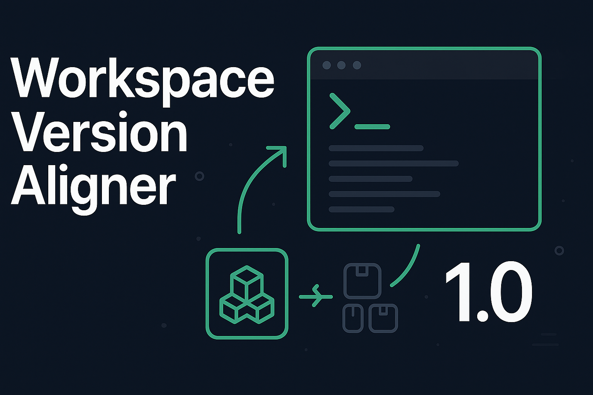

# Workspace Version Aligner

### A tool for managing package versions across monorepo workspaces.

<p align="center">
    
</p>

## Features

- Add/update packages across workspaces
- Sync package versions
- Find and resolve version conflicts
- Interactive CLI with workspace selection
- Support for dependencies, devDependencies, and peerDependencies

## Quick Start

```bash
# Using bun

bun run wva
bun run align-versions

or

# Using npm

npm run wva
npm run align-versions
```

## Usage

1. **Add/Update Package**: Install or update a package across selected workspaces
2. **Sync Versions**: Align package versions across all workspaces
3. **Resolve Conflicts**: Find packages with different versions and standardize them
4. **Install Packages**: Run package installation in selected workspaces

## Requirements

- **Bun** (recommended) or Node.js
- For shell script version: `jq`

## Installation

```bash
npm install
```
